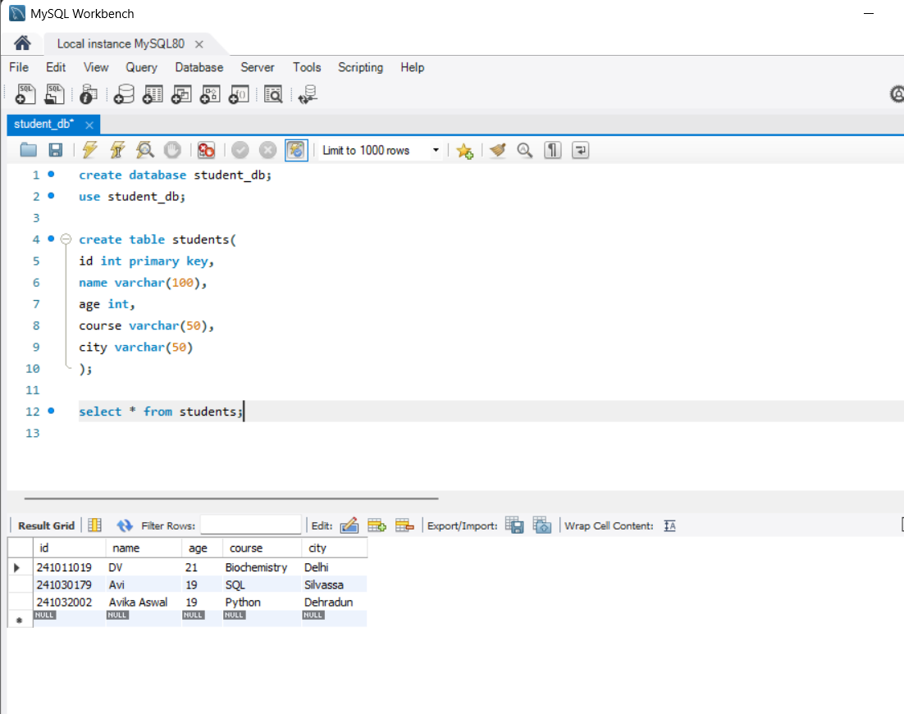

# Student Management System (Python + MySQL)

A simple menu-driven application to manage student records with full CRUD functionality using Python and MySQL.  
This project demonstrates how Python can interact with a MySQL database to perform real-world operations.

---

## 🚀 Features
- Add new student  
- View all students  
- Search student by ID  
- Update student details  
- Delete student  
- MySQL database integration

---

## 🛠️ Technologies Used
- Python  
- MySQL  
- mysql-connector-python  
- VS Code

---

## 🗄️ Database Schema

**Database:** `student_db`  
**Table:** `students`

| Column | Type |
| ------ | ---- |
| id     | INT (Primary Key) |
| name   | VARCHAR(100) |
| age    | INT |
| course | VARCHAR(50) |
| city   | VARCHAR(50) |

---

## ▶️ How to Run

1. **Clone the repository**
```bash
git clone https://github.com/Avika26/student-management-system-python.git
```
2. **Install dependencies**
```bash
pip install mysql-connector-python
```
3. **Create database & table in MySQL**
```bash
CREATE DATABASE student_db;

USE student_db;

CREATE TABLE students (
    id INT PRIMARY KEY,
    name VARCHAR(100),
    age INT,
    course VARCHAR(50),
    city VARCHAR(50)
);
```
4. **Update MySQL credentials in main.py**
```bash
user="root", password="YOUR_PASSWORD"
```
5. **Run the program**
```bash
python main.py
```

## 📸 Screenshots

### ➕ Add Student


### 📄 View Students


### 🗄️ Database Result


## 🎯 Learning Outcomes
- Python-MySQL integration
- Performing CRUD operations
- Menu-driven application development
- Project structuring for GitHub

## 👩‍💻 Author
**Avika Aswal**


